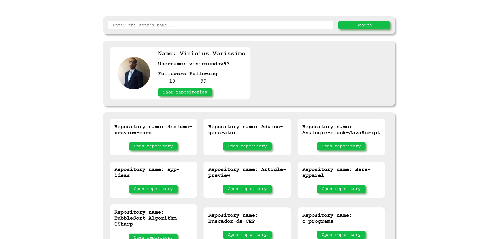

# Aplicação com React usando a API do GitHub para buscar dados de usuários

## Visão Geral

### Screenshot

## Meu processo

### Construído com

-   HTML5
-   CSS3
-   JavaScript
-   React
-   ContextAPI
-   Axios

### O que aprendi

Neste projeto eu pude aplicar os conhecimentos obtidos sobre o Hook de ContextAPI e a biblioteca Axios para construir uma aplicação que busca informaçõesd de usuários e seus repositórios.

## Autor

-   GitHub - Vinícius dos Santos Verissimo (https://github.com/viniciusdsv93)
